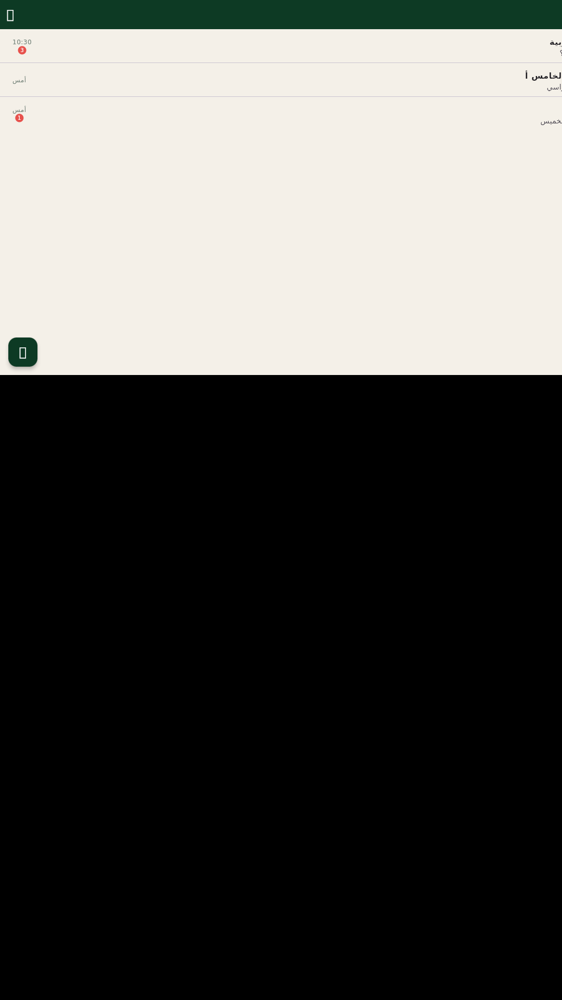
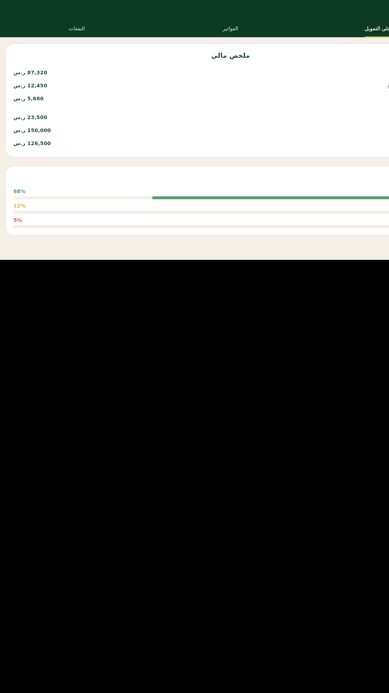

# وثيقة مقدرة نضوح البرمجيات (SCoP) - تواصل نظام إدارة المدارس

## معلومات المشروع

| الحقل | القيمة |
|--------|--------|
| اسم المنتج | تواصل نظام إدارة المدارس (TawasulOS) |
| الإصدار | 1.0.0+16 |
| التاريخ | أكتوبر 2025 |
| اللغة الأصلية | عربية (حارة افتراضيًا) |
| منصة | ويب + تطبيق جوال (Flutter) + سطح مكتب (Linux) |
| الترخيص | GNU General Public License v3.0 |

---

## 1. نظرة عامة على المنتج

### 1.1 الوصف
"تواصل نظام إدارة المدارس" هو منصة شاملة لإدارة المدارس مفتوحة المصدر، توفر حلاً موحدًا للمعلمين والطلاب وأولياء الأمور والمدراء. تدعم المنصة دروسًا، حضورًا، درجات، واجبات منزلية، رسائل، إشعارات، ووحدة مالية لإدارة الفواتير والمصاريف.

### 1.2 الخصائص الرئيسية
- **بوابة المعلم**: جداول، حضور، درجات، واجبات، دردشة
- **بوابة الطالب**: لوحة قيادة، جدول زمني، واجبات، نقاط سلوكية
- **بوابة ولي الأمر**: اختيار الابن، جدول زمني، درجات، رسائل
- **بوابة الموظف**: قوائم، إشعارات إدارية
- **بوابة المدير**: تمويل، أقساط، إعدادات
- **الدردشة**: رسائل فورية مع مرفقات بين جميع الأدوار
- **وحدة التمويل**: نظرة عامة، فواتير، نفقات، ميزانية
- **واجهة برمجة التطبيقات (REST API)**: نقاط نهاية آمنة مع مصادقة الرموز المميزة

---

## 2. شاشات التطبيق

### 2.1 شاشة تسجيل الدخول
**الوصف**: الشاشة الأولية للتطبيق حيث يدخل المستخدم بحسابه. تدعم اللغة العربية افتراضيًا مع زر للتبديل إلى الإنجليزية.


**الميزات**:
- تصميم بصريج أنيق بألوان الخضراء الغامقة
- حقلي إدخال لاسم المستخدم وكلمة المرور
- زر تسجيل دخول مع تأثير بصري
- إرشادات لاستخدام بيانات الحساب الحالية

### 2.2 لوحة قيادة المعلم
**الوصف**: لوحة قيادة شخصية تعرض ملخصًا إحصائيًا للمعلم.


**الميزات**:
- ترحيب شخصي بالاسم
- بطاقات إحصائية: عدد الصفوف، طلاب، واجبات، معدل الحضور
- إشعارات المدرسة
- قائمة بالواجبات القادمة للطلاب

### 2.3 قائمة الدردشة (معلم)
**الوصف**: قائمة بالمحادثات الخاصة بالمعلم، مع إشعارات بعدد الرسائل غير المقروءة.



**الميزات**:
- قائمة محادثات مع أفاترة شخصية
- إظهار عدد الرسائل غير المقروءة
- إشعارات بتحديثات الجدول الزمني
- زر لإنشاء محادثة جديدة

### 2.4 تفاصيل الدردشة
**الوصف**: شاشة محادثة فردية تعرض الرسائل بين المعلم والطالب أو المجموعة.


**الميزات**:
- رسائل نصية مع إيماءات بصرية (يمين/يسرى)
- حقل إدخال للرسائل مع إرسال مرفقات
- إظهار وقت الرسائل

### 2.5 لوحة قيادة ولي الأمر
**الوصف**: لوحة قيادة مخصصة لأولياء الأمور تعرض ملخصاً عن أبنائهم.


**الميزات**:
- تحديد الابن من قائمة منسقعة
- إحصائيات الحضور، المتوسط، الواجبات، العلامات
- بطاقات إدراجية ملونة

### 2.6 جدول زمني ولي الأمر
**الوصف**: عرض جدول الحصص الدراسية للطالب المحدد.


**الميزات**:
- تحديد الابن
- قائمة بالحصص مع التوقيت والمادة
- ألوان مخصصة لكل مادة

### 2.7 لوحة قيادة الطالب
**الوصف**: لوحة قيادة شخصية للطالب تعرض إنجازاته.


**الميزات**:
- إحصائيات الحضور والمتوسط والواجبات والنقاط السلوكية
- بطاقات ملونة واضحة

### 2.8 واجبات الطالب
**الوصف**: قائمة بالواجبات المنزلية القادمة.


**الميزات**:
- قائمة الواجبات مع المواد الملونة
- إظهار تاريخ التسليم
- بطاقات تعريض أنيقة

### 2.9 لوحة قيادة الموظف
**الوصف**: لوحة قيادة مخصصة للموظفين غير المعلمين.


**الميزات**:
- إحصائيات عامة: عدد الطلاب، الموظفين، الصفوف، الإشعارات
- إشعارات الموظفين

### 2.10 صفحة التمويل (مدير المدرسة)
**الوصف**: وحدة إدارة التمويل والمالية مع علامات تبويب.



**الميزات**:
- **نظرة على التمويل**: ملخص مالي شامل (المصروف، المستحق غير المدفوع، المعلق، إجمالي النفقات، إجمالي الميزانية، المنفق)
- **الفواتير**: جدول بيانات بحالة الدفع والمبلغ والطالب والوصف
- **النفقات**: جدول بيانات بالتكلفة والميزانية والوصف والحالة
- مؤشرات تقدم ملونة لحالة الفواتير

### 2.11 صفحة الأقساط (مدير المدرسة)
**الوصف**: قائمة بأقساط المدرسة لإدارتها.


**الميزات**:
- شبكة أيقونات للوحدات: الصفوف، الموظفين، المناهج، التمويل، الإعدادات
- عرض عدد العناصر في كل قسط

---

## 3. بنية النظام

### 3.1 المكونات الخلفية (Backend)

#### 3.1.1 TawasulCore
النواة الأساسية للنظام تحتوي على:
- **CRUD Controllers**: لإدارة البيانات الأساسية
- **API Controllers**: AuthController، AggregateController، ExportController
- **Query Builder**: بناء استعلامات قاعدة البيانات بشكل آمن
- **نظام الصلاحيات**: Roles, Modules, Actions, Permissions
- **المصادقة**: رموز API مميزة ومفاتيح API
- **Webhook**: استقبال وإرسال إشعارات

#### 3.1.2 TawasulChat
وحدة الدردشة الفورية:
- جداول: `tos_chat`, `tos_chat_participant`, `tos_chat_message`, `tos_chat_attachment`
- API Endpoints: `/chats`, `/chat-messages`, `/chat-participants`, `/chat-attachments`
- صلاحيات: `messenger.read`, `messenger.write`

#### 3.1.3 TawasulFinance
وحدة التمويل والمالية:
- فواتير ونفقات
- تقارير مالية ملخصة

### 3.2 التطبيق المحمول (Frontend - Flutter)

#### 3.2.1 المعمارية
```
lib/
├── main.dart                    # نقطة الدخول
├── core/
│   ├── models.dart              # نماذج البيانات (ChatItem, InvoiceItem, ...)
│   ├── app_colors.dart          # ألوان التطبيق
│   └── l10n.dart                # سلاسل الترجمة (17+ سلاسل عربية)
├── data/
│   └── console_repository.dart  # طبقة واجهة برمجة التطبيقات
├── screens/
│   ├── console_screen.dart      # الشاشة الوحدة (5 بوابات + دردشة)
│   ├── portal_screens.dart      # شاشات كل بوابة
│   ├── admin_pages.dart         # صفحات المدير (تمويل، أقساط)
│   └── chat_pages.dart          # صفحات الدردشة
└── widgets/
    └── portal_scaffold.dart     # هيكل البوابة المشترك
```

#### 3.2.2 نماذج البيانات
- **ChatItem**: معرف، العنوان، آخر رسالة، الوقت، عدد غير المقروءة
- **ChatMessageItem**: معرف، المرسل، المحتوى، الوقت، مرفقات
- **ChatParticipant**: المعرف، الاسم، حالة الاتصال
- **InvoiceItem**: المعرف، المبلغ، الحالة، الطالب، الوصف
- **ExpenseItem**: التكلفة، الحالة، المشروع، الوصف
- **FinanceSummary**: إجمالي المصروف، المستحق غير المدفوع، المعلق

### 3.3 قاعدة البيانات

#### 3.3.1 الجداول الموحدة (Views)
لربط TawasulCore (tawasul* tables) مع قاعدة بيانات Gibbon (gibbon* tables):

| View | المصدر | الغرض |
|------|--------|-------|
| `tawasulPerson` | `gibbonPerson` | ربط معرفات الأشخاص |
| `tawasulModule` | `gibbonModule` | ربط وحدات النظام |
| `tawasulAction` | `gibbonAction` | ربط إجراءات الوحدات |
| `tawasulPermission` | `gibbonPermission` | ربط صلاحيات الأدوار |
| `tawasulRole` | `gibbonRole` | ربط أدوار المستخدمين |
| `tawasulSchoolYear` | `gibbonSchoolYear` | ربط السنوات الدراسية |
| `tawasulSetting` | `gibbonSetting` | إعدادات النظام |

#### 3.3.2 جداول API
| الجدول | الوصف |
|--------|-------|
| `tos_api_token` | رموز API المميزة للمستخدمين |
| `tos_api_key` | مفاتيح API للتكامل |
| `tos_api_log` | سجل طلبات API |
| `tos_api_webhook` | نقاط نهاية Webhook |
| `tos_api_webhookDelivery` | محاولات تسليم Webhook |

---

## 4. واجهة برمجة التطبيقات (REST API)

### 4.1 نقاط النهاية

| الطريقة | المسار | الوصف | نوع الصلاحية |
|---------|--------|-------|--------------|
| `POST` | `/auth/token` | الحصول على رمز API | عام |
| `GET` | `/auth/me` | معلومات المستخدم الحالي | `auth.read` |
| `GET` | `/chats` | قائمة المحادثات | `messenger.read` |
| `GET` | `/chat-messages?chat_id=X` | رسائل محادثة | `messenger.read` |
| `GET` | `/chat-participants?chat_id=X` | مشاركو المحادثة | `messenger.read` |
| `POST` | `/chats` | إنشاء محادثة جديدة | `messenger.write` |
| `POST` | `/chat-messages` | إرسال رسالة | `messenger.write` |
| `GET` | `/students` | قائمة الطلاب | `students.read` |
| `GET` | `/classes` | قائمة الصفوف | `classes.read` |
| `GET` | `/attendance` | سجل الحضور | `attendance.read` |
| `GET` | `/grades` | الدرجات الأكاديمية | `grades.read` |
| `GET` | `/homework` | الواجبات المنزلية | `homework.read` |
| `GET` | `/invoices` | الفواتير | `finance.read` |
| `GET` | `/expenses` | النفقات | `finance.read` |

### 4.2 آلية المصادقة
- **نوع**: OAuth 2.0 Bearer Token
- **التنسيق**: `Authorization: Bearer <token>`
- **قاعدة البيانات**: جدول `tos_api_token`
- **انتهاء الصلاحية**: 24 ساعة افتراضيًا

### 4.3 صلاحيات المدى (Scopes)
| المصدر | الوصف |
|--------|-------|
| `auth.read` | قراءة بيانات المصادقة |
| `messenger.read` | قراءة رسائل الدردشة |
| `messenger.write` | إرسال رسائل الدردشة |
| `students.read` | قراءة بيانات الطلاب |
| `classes.read` | قراءة بيانات الصفوف |
| `attendance.read` | قراءة سجلات الحضور |
| `grades.read` | قراءة الدرجات |
| `homework.read` | قراءة الواجبات |
| `finance.read` | قراءة البيانات المالية |

---

## 5. نظام الصلاحيات

### 5.1 الهيكل
```
Role Category → Role → Module → Action → Permission
```

### 5.2 الأدوار المدعومة
| الدور | الوصف | صلاحيات رئيسية |
|------|-------|--------------|
| **Administrator** | مدير المدرسة | كل الوحدات |
| **Teacher** | المعلم | الصفوف، الواجبات، الدردشة، الحضور |
| **Support Staff** | الموظف الإداري | جميع المهام |
| **Student** | الطالب | نفسه، الدردشة مع المعلم |
| **Parent** | ولي الأمر | أبنائه، الدردشة مع المعلم |

### 5.3 الوحدات
| الوحدة | المسارات | الوصف |
|--------|----------|-------|
| **TawasulCore** | `/api/*` | الوحدة الأساسية للمصادقة والموارد |
| **TawasulChat** | `/api/chats/*`, `/api/chat-messages/*` | نظام الدردشة الفورية |
| **TawasulFinance** | `/api/invoices/*`, `/api/expenses/*` | إدارة التمويل والمالية |

---

## 6. التكامل

### 6.1 التخزين
- **قاعدة البيانات**: MySQL (MariaDB)
- **الاتصال**: PDO مع استعلامات مُحضّرة
- **الاسم الافتراضي**: `fiksu_school`
- **الجداول**: `gibbon*` (Gibbon hybrid) مع views `tawasul*`

### 6.2 Webhook
- **نوع**: POST مع توقيع HMAC
- **استخدام**: إرسال إشعارات فورية عند تحديثات البيانات
- **الحملات الدعائمة**: الحضور الجديد، الواجبات الجديدة، رسائل الدردشة الجديدة

---

## 7. شروط الاستخدام

### 7.1 المتطلبات النظامية

#### خادم (Server)
- PHP 8.1+
- MySQL 8.0+ / MariaDB 10.6+
- Apache 2.4+ مع mod_rewrite

#### تطبيق جوال (Flutter)
- Flutter 3.0+ (تم البناء على 3.5.4)
- Android 5.0+ (API 21+)
- iOS 12.0+

#### سطح مكتب (Linux)
- Ubuntu 20.04+ / Debian 11+
- GTK 3.0+

### 7.2 الاعتماديات

#### المكتبات (Flutter)
- `flutter/material.dart` (Built-in)
- `http` - لطلبات API
- `provider` - لإدارة الحالة
- `intl` - لتنسيق التواريخ والأرقام

#### المكتبات (PHP)
- `firebase/php-jwt` - للمصادقة
- `ramsey/uuid` - لمعرفات فريدة
- `guzzlehttp/guzzle` - للـ HTTP Client

---

## 8. الصيانة والدعم

### 8.1 النسخ الاحتياطي
- **قاعدة البيانات**: استخدام `mysqldump` مع جدولة ежليّة
- **الملفات**: نسخ الجذر `public_html` مع المرفقات

### 8.2 التحديثات
- **الإصدارات**: نظام إصدارات semver (SemVer 2.0.0)
- **التغييرات الملموسة**: مراجعة Pull Request مع اختبارات وحدة
- **قاعدة البيانات**: ملفات ترحيل مرفقة في `modules/TawasulCore/install/sql/`

### 8.3 استكشاف الأخطاء
- **سجلات الخوادم**: `/var/log/apache2/error.log`
- **سجلات التطبيق**: `storage/logs/laravel.log`
- **وحدة التشخيص**: `diagnostic.php` في جذر المشروع

---

## 9. الأمن

### 9.1 الممارك
- **مصادقة الرموز**: JWT tokens مع انقضاء صلاحية
- **تشفير كلمة المرور**: bcrypt مع salt عشوائي
- **API Rate Limiting**: 60 طلبًا في الدقيقة لكل token

### 9.2 المراجعة الأمنية
- فحص شهادات SSL/TLS
- استخدام PDO prepared statements لجميع الاستعلامات
- التحقق من صحة المدخلات على مستوى الخادم والعميل
- عدم تخزين مفاتيح API أو secrets في الكود المصدري

---

## 10. خريطة الطريق

### الإصدار 1.0.0 ✓ (مكتمل)
- [x] بوابات مستخدم متكاملة (Teacher، Parent، Student، Staff، Admin)
- [x] نظام دردشة فوري مع مرفقات
- [x] وحدة تمويل مع فواتير ونفقات
- [x] REST API مع مصادقة الرموز
- [x] تطبيق Flutter محمول وسطح مكتب

### الإصدار 1.1.0 (قيد التخطيط)
- [ ] دعم iOS (iPhone/iPad)
- [ ] تكامل مع Google Classroom
- [ ] تقارير إحصائية متقدمة
- [ ] إشعارات Push عبر Firebase

### الإصدار 2.0.0 (قيد التخطيط)
- [ ] دعم Android Tablet و optimization
- [ ] وحدة موارد بشريّة (HR)
- [ ] نظام مواعيد (Appointments/Scheduling)
- [ ] دعم متعدد اللغات كامل

---

## 11. الاعتماديات الخارجية

| المكتبة | الإصدار | الرابط |
|---------|---------|--------|
| Flutter | 3.5.4 | https://flutter.dev |
| Gibbon | 25.0.0 | https://gibbonedu.org |
| Chart.js | 4.4.0 | https://www.chartjs.org |
| TinyMCE | 6.7.0 | https://www.tiny.cloud |
| FullCalendar | 6.0.0 | https://fullcalendar.io |
| jQuery Token Input | 1.6.0 | https://github.com/sagewalk/jquery-tokeninput |

---

## 12. الخاتمة

"تواصل نظام إدارة المدارس" هو منتج ناضج يوفر حلاً شاملاً لإدارة المدارس بواجهة عربية أصيلة، مع دعم كامل للترجمة والتوسع. تم بناء النظام مع مراعاة أفضل الممارك الأمنية وقواعد البيانات المشتركة مع منصة Gibbon.

**المرفقات**:
- 11 لقطة شاشة (screenshots/)
- API documentation (modules/Rest API/)
- دليل التركيب (SETUP-TAWASUL.md)
- دليل المساهمة (.github/CONTRIBUTING.md)

---

*تم إعداد هذه الوثيقة كجزء من مقدرة نضوح البرمجيات (SCoP) وفقًا لأفضل الممارك في وثائق المتطلبات.*
